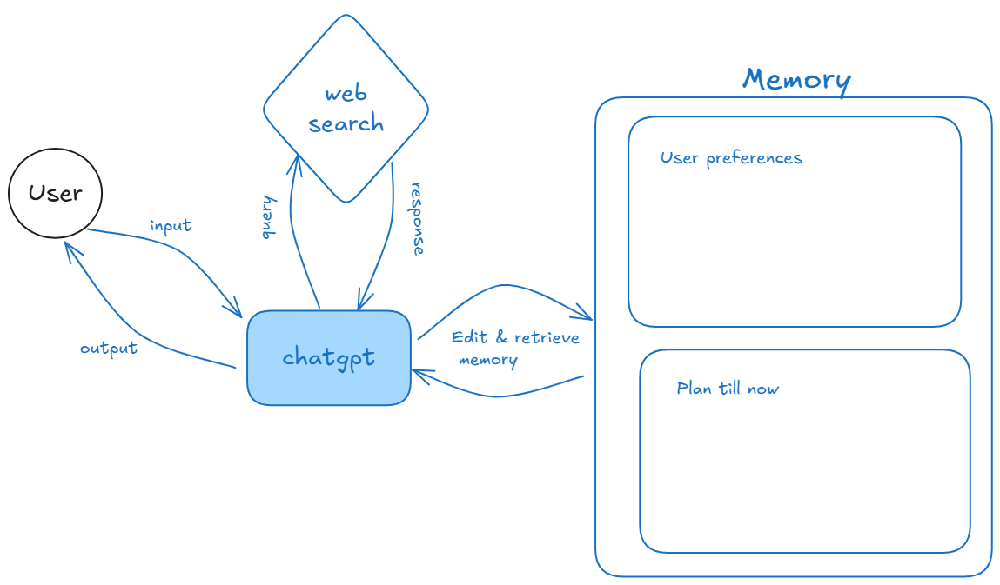

# Basic description
I tried a lot of things with langgrpah, neo4j and there were stupid errors of dependecy conflicts that I didnt know how to sovle so I tried the universal problem solving technique: I deleted everything and started from scratch   
No lmao, the technique is try to solve a simpler problem first  
So i boiled down the problem a simple one chat interface with user, memory is stored simply in strings and the data flow happens through reading and manipulating structured outputs from user and llms. A simple way to understand this would be this diagram



# A bit more detail
Theres only 4 parts to the code
- One defines all the "state" variables, that will be used to represent the memory of the program
This consistes of the variables messages, system_prompt, user_preferences, plan
- The second part is the api calling and output parsing functions. The system_prompt makes the output of the llm strcutered into a json format which unables us to easily parse it (tho this was not at all easy, big big headache i dont even know the reaosn why. I have added a "retyr 5 times if things go wrong because truly the output predicitiblity of llm is low)
- The third part is the main part that handles what to do after you get user input. IT codes the diagram, handles web search, all the sweet stuff
- The fourth part is the culmination, it creates the final itenary, or "till that stage" itenary
- Note: Groq API is used instea dof Ollama because my computer has no gpu and it was running really slowly, so to have fast iterations, i subsituted it for groq. Tho both are openAI api compatible so interchaning between them is not too difficult
# How to run
- Enter a virtual environemnt through `python -m venv venv` and then activate it. (`venv\Scripts\activate` on windows)
- Install the requirements through `pip install -r requirements.txt`
- Setup the .env files (not included in this repo) with the following api keys
```env
GROQ_API_KEY=gsk_
TAVILY_API_KEY=tvly-
```
- Run the code through `python main.py`

(and pray to god it works 🤞)

# Demo
The video demo for this is availaible in this [drive link](https://drive.google.com/file/d/1tqtUk7SrNA7fPJeS3e0pNCasEqBOrVAh/view?usp=sharing) and also in this repo too

# what got left
- Neo4j graph databse backing for memory was very tricky to implement even with ongoing dependcy issues. I have left it for now because I felt for a  small test case like this, a string solution for memory works good enough
- Multiple agents couldnt be used persay. One agent and one tool callign is utilizied and it handles the work fairly decently. Tho I initially startedd with planner architecture in langgraph but I couldnt make it work, so settled to this (solve an easier problem)
- Registration, backend

I apologize for not being able to do it completely but I put my soul and then some into making this. If you consider my sleep to be soul, well i put that too. I hope you like it. And thank you, this assingment was much better than a dsa test, had a lot of fun doing it. 


